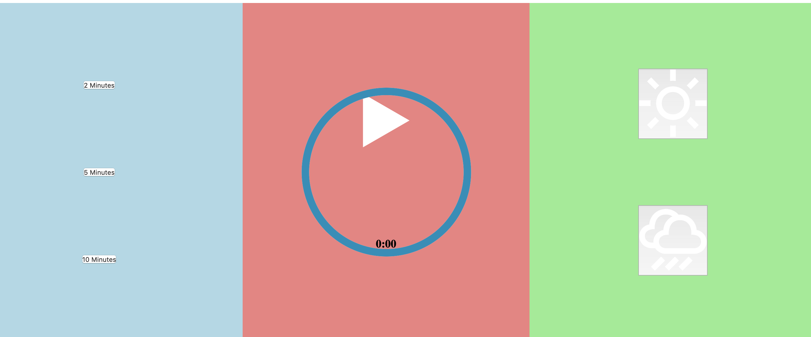
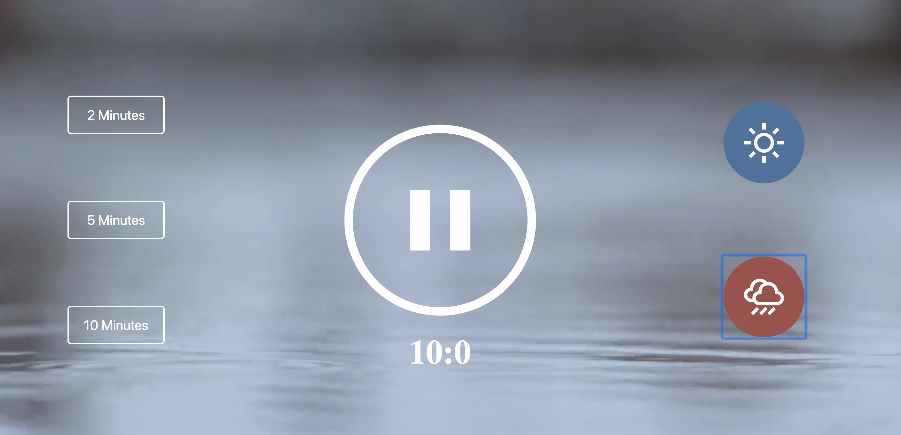

# Meditation app
Meditation app <a href="https://www.youtube.com/watch?v=oMBXdZzYqEk&list=PLDyQo7g0_nsXlSfuoBpG5Fgz0Qe3IvWnA&index=10">tutorial</a> using vanilla JavaScript.  Full credit goes to DevEd for this beautiful app.

It is an app that required a lot of css styling.  The app went from looking like this:




To this:




The app plays the sound of rain or the beach while you meditate.  You can choose to meditate for two, five or 10minutes.  

## Instructions

Clone the App
```
git clone git@github.com:LisaMcCormack/meditation-app.git
```

In the terminal:
```
open index.html
```
